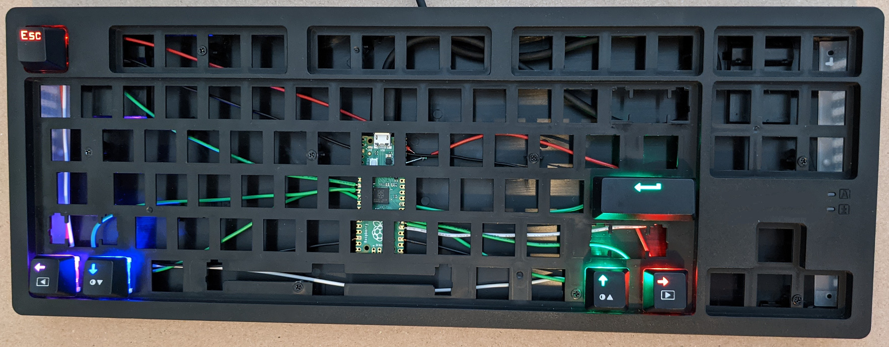
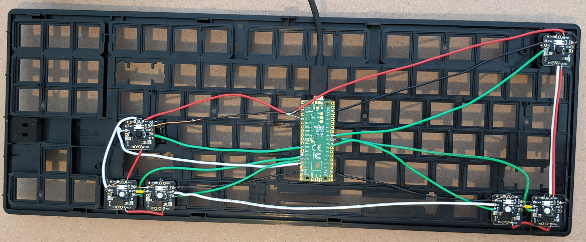

# Friday Night Funkin Keyboard Controller

[Friday Night Funkin](https://www.newgrounds.com/portal/view/770371) (FNF) is a
[rhythm game](https://en.wikipedia.org/wiki/Rhythm_game) that works in a web
browser.



This project is a simple keyboard controller for FNF. This is a 6 key (arrow
keys, ESC, and Enter) keyboard with 1000 Hz polling, RGB LEDs, and sockets. The
key switch sockets means you can experiment with different key switches and
springs without desoldering. The keyboard can be used with other 4K games. For
example, my current fancy is Gateron Brown key switches with 150 gf springs.
This could be expanded for more complex games such as DJMAX 8K + 2 side tracks
(10 keys).

Start by disassembling the mechanical keyboard. As of this writing, both
keyboards shown below are socketed so disassembling is easy. The Redragon has a
metal plate while the other has a plastic plate. A metal plate is rigid while a
plastic plate will flex slightly.

Plug in key switches at locations comfortable for your hands. Since the single
key PCB is socketed, it is easy to move the key switches until you find the
ideal location. I do not like cramming my hands together so I arranged the
four arrow keys with two on the far left and the other two on the far right.

Plug in the single key PCBs. Here is my hand soldering strategy. Because
I chose to use the bottom row of the keyboard (CTRL, ALT, etc.) the key
spacing requires snapping apart the switch PCBs.

Connect the grounds. The Pi Pico has multiple grounds so this is convenient.
The Adafruit boards have 2 grounds so they can be daisy chained.

On each PCB connect Col to GND. Col is one end of the key switch. There are
only six switches so they will not be wired in a matrix so the Col and Row pin
names are misleading.

On each PCB connect Row to a GPIO pin on the Pi Pico. The following source code
shows the GPIO pins used.

```
Button_t Buttons[NUM_BUTTONS] = {
  {D7, HID_KEY_ARROW_LEFT, 4, 0x800080UL},
  {D8, HID_KEY_ARROW_DOWN, 3, 0x0000FFUL},
  {D6, HID_KEY_ESCAPE, 5, 0xFF0000UL},
  {D22, HID_KEY_ENTER, 0, 0x00FF00UL},
  {D20, HID_KEY_ARROW_UP, 2, 0x00FF00UL},
  {D21, HID_KEY_ARROW_RIGHT, 1, 0xFF0000UL},
};
```

Connect 3V3_OUT (pin 36) on the Pi Pico to VIN on the Adafruit boards. Each
board has 2 VIN so they can be daisy chained.

Connect the WS2812 data pins in a series. Connect In(I) on the first board
to GP19 (D19). Note the latest Adafruit NeoPixel library when used on RP2040
boards supports the RP2040 PIO state machine. It does NOT bit bang.

```
#include "Adafruit_NeoPixel.h"
#define LED_PIN   (D19)
#define LED_COUNT (6)
Adafruit_NeoPixel strip(LED_COUNT, LED_PIN, NEO_GRB + NEO_KHZ800);
```

Each board has two WS2812 inputs (In and I) and two outputs (Out and O). In and
I are connected to the WS2812 input and Out and O are connected to the WS2812
output. Wire the boards in a series connecting Out/O on one board to In/I on
the next board.

## Hardware



The wiring is ugly but this was a test (successful). I will probably pull this
one apart and try a DJMax 8K + 2 side track controller. Maybe with a selector
to switch between arrow keys, WASD, DFJK, etc. so it can be used for a variety
of rhythm games.

Quantity|Description        |Comments
--------|-------------------|----------------------
6       |key switches       |Use the ones included with the keyboard or use any Cherry MX compatible key switches.
6       |key caps           |Use the ones included with the keyboard or use any Cherry MX compatible key caps.
6       |single key PCB     |The PCB for a single Cherry MX compatible key switch with RGB LED and Kailh socket. https://www.adafruit.com/product/5157
1       |mechanical keyboard|For example, https://www.amazon.com/gp/product/B089PWMKG1 or this one https://www.amazon.com/gp/product/B016MAK38U.
1       |Raspberry Pi Pico  |The brains.

## Software

4kkeyboard.ino contains the Arduino sketch source code.

The file 4kkeyboard.ino.rpipico.uf2 can be used to program the Pi Pico without
installing the Arduino IDE, Arduino libraries, etc. To install the code on the
Pi Pico, unplug the Pi Pico from USB. Press and hold the Pi Pico BOOTSEL button.
Plug the Pi Pico into a computer USB port. A USB drive should appear named
RPI-RP2. Drag and drop the UF2 file on the RPI-RP2 drive. Wait a few seconds
for the Pi Pico to install the program. The RPI-RP2 drive will disappear.

To compile the source code, install the Arduino IDE (version 1.8.15 as of this
writing). Install the Raspberry Pi Pico board support from
https://github.com/earlephilhower/arduino-pico. Use the IDE library manager to
install the Bounce2 and Adafruit NeoPixel libraries. Select Tools > USB Stack >
Adafruit TinyUSB. At this point, the IDE should be able to compile and upload
the 4kkeyboard.ino sketch.

If you want to generate a UF2 file, in the IDE select Sketch > Export compiled
Binary. This leaves the UF2 file in the same directory as the INO file.
